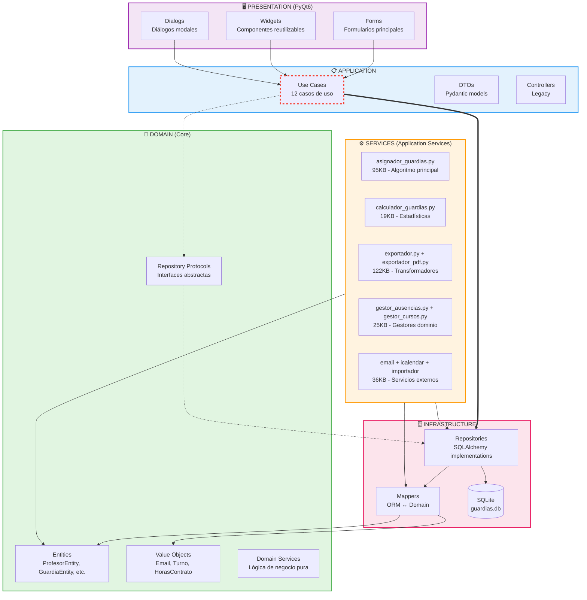

# Diagrama de Arquitectura - Guardias de Patio

## Dependencias entre Capas (Estado Real)



## Leyenda

- `-->` Dependencia correcta (flecha sólida)
- `-.->` Dependencia ideal vía interfaces (flecha punteada)
- `==>` ⚠️ **Violación arquitectónica** (flecha gruesa - 6 use cases)

## Violaciones Conocidas

**Cantidad**: 6 imports directos `application → infrastructure`

**Archivos afectados**:
1. `application/use_cases/guardia/obtener_guardias.py`
2. `application/use_cases/guardia/asignar_guardia.py`
3. `application/use_cases/profesor/listar_profesores.py`
4. `application/use_cases/profesor/obtener_profesor.py`
5. `application/use_cases/profesor/crear_profesor.py` (2 imports)

**Patrón actual** ❌:
```python
from infrastructure.repositories import SQLAlchemyProfesorRepository
```

**Patrón esperado** ✅:
```python
from domain.repositories import ProfesorRepositoryProtocol
```

## Capas y Responsabilidades

| Capa | Responsabilidad | Tamaño | Conformidad |
|------|----------------|--------|-------------|
| **Domain** | Lógica de negocio pura | ~50KB | ✅ 100% |
| **Application** | Casos de uso | ~80KB | ⚠️ 85% |
| **Services** | Lógica aplicación compleja | 361KB | ⚠️ N/A |
| **Infrastructure** | Persistencia, BD | ~120KB | ✅ 95% |
| **Presentation** | UI PyQt6 | ~200KB | ✅ 100% |

**Puntuación Global**: ⭐⭐⭐⭐ (4/5)

## Notas

- La carpeta `/services` está en `src/services/` por pragmatismo (idealmente sería `src/application/services/`)
- Las 6 violaciones son de severidad **media** (no bloqueantes, pero rompen DIP)
- Domain está **perfectamente aislado** (0 violaciones)
- Presentation solo depende de Application (correcto)

---

**Fecha**: 12 de noviembre de 2025  
**Fuente**: Auditoría FASE 2 - Consolidación de Código
