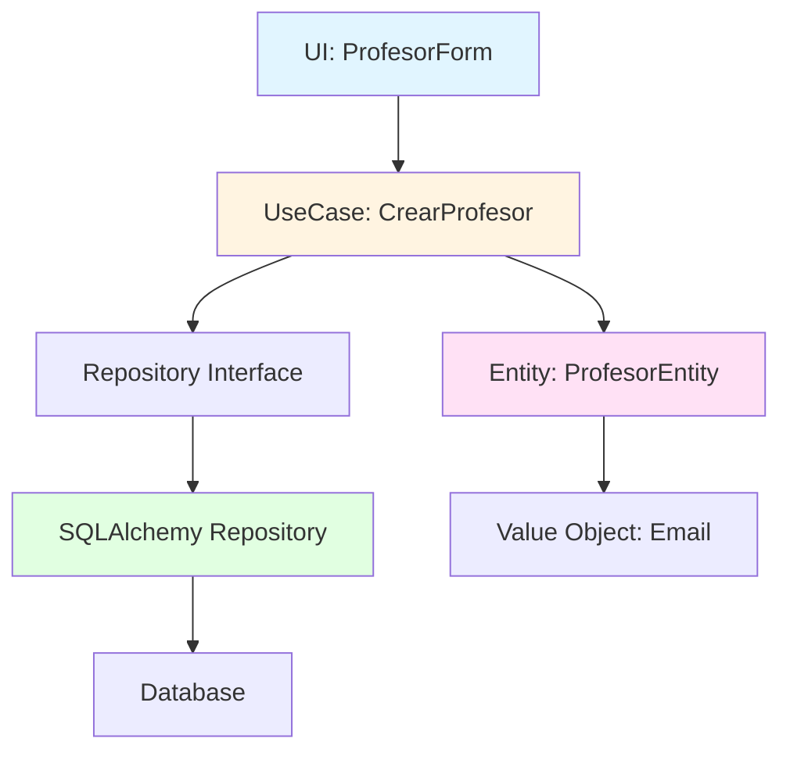

# Arquitectura del Sistema - Guardias de Patio

## 📋 Índice

1. [Visión General](#visión-general)
2. [Arquitectura Clean Architecture](#arquitectura-clean-architecture)
3. [Capas del Sistema](#capas-del-sistema)
4. [Flujo de Datos](#flujo-de-datos)
5. [Patrones de Diseño](#patrones-de-diseño)
6. [Estructura de Directorios](#estructura-de-directorios)
7. [Tecnologías Utilizadas](#tecnologías-utilizadas)
8. [Decisiones Arquitectónicas](#decisiones-arquitectónicas)
9. [Testing Strategy](#testing-strategy)
10. [Referencias](#referencias)

---

## 🎯 Visión General

**Guardias de Patio** es un sistema de gestión automatizada de guardias escolares que implementa **Clean Architecture** para garantizar:

- ✅ **Separación de responsabilidades**
- ✅ **Independencia de frameworks**
- ✅ **Testabilidad**
- ✅ **Mantenibilidad a largo plazo**

### Principio Fundamental

> "Las dependencias deben apuntar hacia adentro, hacia las políticas de alto nivel"

```
┌─────────────────────────────────────────────┐
│           🖥️  UI (PyQt6)                    │
├─────────────────────────────────────────────┤
│     📦 Application (Use Cases)              │
├─────────────────────────────────────────────┤
│       💎 Domain (Entities)                  │
├─────────────────────────────────────────────┤
│   🔧 Infrastructure (SQLAlchemy)            │
└─────────────────────────────────────────────┘
        ↑ Dependencias apuntan hacia arriba
```

---

## 🏗️ Arquitectura Clean Architecture

### Diagrama General

```
┌───────────────────────────────────────────────────────────┐
│                    PRESENTATION LAYER                     │
│                        (PyQt6)                            │
│                                                           │
│  ┌─────────────┐  ┌──────────────┐  ┌─────────────┐    │
│  │   Forms     │  │   Widgets    │  │    Main     │    │
│  └─────────────┘  └──────────────┘  └─────────────┘    │
└───────────────────────────────────────────────────────────┘
                          ↓ calls
┌───────────────────────────────────────────────────────────┐
│                   APPLICATION LAYER                       │
│                     (Use Cases)                           │
│                                                           │
│  ┌─────────────────────────────────────────────────┐    │
│  │  Casos de Uso: Crear, Listar, Actualizar, etc. │    │
│  │  DTOs: Objetos de transferencia de datos       │    │
│  └─────────────────────────────────────────────────┘    │
└───────────────────────────────────────────────────────────┘
                          ↓ uses
┌───────────────────────────────────────────────────────────┐
│                     DOMAIN LAYER                          │
│                  (Reglas de Negocio)                      │
│                                                           │
│  ┌──────────┐  ┌──────────┐  ┌───────────────────┐     │
│  │ Entities │  │  Values  │  │   Repositories    │     │
│  │          │  │ Objects  │  │   (Interfaces)    │     │
│  └──────────┘  └──────────┘  └───────────────────┘     │
└───────────────────────────────────────────────────────────┘
                          ↑ implements
┌───────────────────────────────────────────────────────────┐
│                 INFRASTRUCTURE LAYER                      │
│                  (Detalles Técnicos)                      │
│                                                           │
│  ┌─────────────┐  ┌──────────┐  ┌──────────────┐       │
│  │ SQLAlchemy  │  │ Mappers  │  │   Database   │       │
│  │Repositories │  │          │  │    Manager   │       │
│  └─────────────┘  └──────────┘  └──────────────┘       │
└───────────────────────────────────────────────────────────┘
```

### Flujo de Dependencias



---

## 📦 Capas del Sistema

### 1. Domain Layer (Dominio)

**Ubicación**: `src/domain/`

**Responsabilidad**: Contiene las **reglas de negocio puras** independientes de cualquier framework.

#### Entities (Entidades)

```python
# src/domain/entities/profesor_entity.py
class ProfesorEntity:
    """Entidad de dominio para Profesor."""
    
    def __init__(
        self,
        id: Optional[int],
        nombre_completo: str,
        email_corporativo: Email,
        horas_contrato: HorasContrato,
        # ...
    ):
        self.id = id
        self.nombre_completo = nombre_completo
        self.email = email_corporativo
        self.horas_contrato = horas_contrato
    
    def puede_tener_guardias(self) -> bool:
        """Lógica de negocio: determina si puede tener guardias."""
        return self.horas_contrato.valor >= 10
```

**Características**:
- ✅ Sin dependencias externas
- ✅ Lógica de negocio pura
- ✅ Fácilmente testeable

#### Value Objects

```python
# src/domain/value_objects/email.py
class Email:
    """Value Object para email con validación."""
    
    def __init__(self, valor: str):
        if not self._es_valido(valor):
            raise ValueError(f"Email inválido: {valor}")
        self._valor = valor
    
    @staticmethod
    def _es_valido(email: str) -> bool:
        return "@" in email and "." in email.split("@")[1]
    
    @property
    def valor(self) -> str:
        return self._valor
```

**Características**:
- ✅ Inmutables
- ✅ Auto-validación
- ✅ Encapsulación de lógica

#### Repository Interfaces

```python
# src/domain/repositories/profesor_repository.py
from abc import ABC, abstractmethod

class ProfesorRepository(ABC):
    """Interfaz de repositorio (independiente de implementación)."""
    
    @abstractmethod
    def obtener_por_id(self, id: int) -> Optional[ProfesorEntity]:
        pass
    
    @abstractmethod
    def obtener_todos(self) -> List[ProfesorEntity]:
        pass
    
    @abstractmethod
    def guardar(self, profesor: ProfesorEntity) -> ProfesorEntity:
        pass
```

**Ventajas**:
- ✅ Inversión de dependencias
- ✅ Facilita testing con mocks
- ✅ Permite cambiar DB sin tocar dominio

---

### 2. Application Layer (Aplicación)

**Ubicación**: `src/application/`

**Responsabilidad**: Orquestar la **lógica de aplicación** mediante casos de uso.

#### Use Cases (Casos de Uso)

```python
# src/application/use_cases/profesor/crear_profesor.py
class CrearProfesor:
    """Caso de uso: Crear un nuevo profesor."""
    
    def __init__(self, repository: ProfesorRepository):
        self._repo = repository
    
    def execute(self, dto: CrearProfesorDTO) -> ProfesorDTO:
        """Ejecuta el caso de uso."""
        # 1. Validar datos
        email = Email(dto.email_corporativo)
        horas = HorasContrato(dto.horas_contrato)
        
        # 2. Crear entidad
        profesor = ProfesorEntity(
            id=None,
            nombre_completo=dto.nombre_completo,
            email_corporativo=email,
            horas_contrato=horas,
            # ...
        )
        
        # 3. Persistir
        profesor_guardado = self._repo.guardar(profesor)
        
        # 4. Devolver DTO
        return ProfesorDTO.from_entity(profesor_guardado)
```

**Características**:
- ✅ Un caso de uso = Una acción del usuario
- ✅ Orquesta entidades y repositorios
- ✅ Maneja transacciones

#### DTOs (Data Transfer Objects)

```python
# src/application/dtos/profesor_dto.py
@dataclass
class ProfesorDTO:
    """DTO para transferir datos de Profesor."""
    id: Optional[int]
    nombre_completo: str
    email_corporativo: str
    horas_contrato: float
    # ...
    
    @classmethod
    def from_entity(cls, entity: ProfesorEntity) -> 'ProfesorDTO':
        """Convierte entidad a DTO."""
        return cls(
            id=entity.id,
            nombre_completo=entity.nombre_completo,
            email_corporativo=entity.email.valor,
            horas_contrato=entity.horas_contrato.valor,
            # ...
        )
```

**Ventajas**:
- ✅ Desacopla capas
- ✅ Serialización simple
- ✅ Versionamiento de API

---

### 3. Infrastructure Layer (Infraestructura)

**Ubicación**: `src/infrastructure/`

**Responsabilidad**: Implementar **detalles técnicos** (BD, APIs, archivos, etc.).

#### SQLAlchemy Repositories

```python
# src/infrastructure/repositories/sqlalchemy_profesor_repository.py
class SQLAlchemyProfesorRepository(ProfesorRepository):
    """Implementación de repositorio con SQLAlchemy."""
    
    def __init__(self, session: Session):
        self._session = session
    
    def obtener_por_id(self, id: int) -> Optional[ProfesorEntity]:
        modelo = self._session.query(Profesor).get(id)
        if not modelo:
            return None
        return ProfesorMapper.to_entity(modelo)
    
    def guardar(self, profesor: ProfesorEntity) -> ProfesorEntity:
        modelo = ProfesorMapper.to_model(profesor)
        self._session.add(modelo)
        self._session.flush()
        return ProfesorMapper.to_entity(modelo)
```

**Características**:
- ✅ Implementa interfaces de dominio
- ✅ Maneja detalles de BD
- ✅ Usa mappers para conversión

#### Mappers

```python
# src/infrastructure/mappers/profesor_mapper.py
class ProfesorMapper:
    """Convierte entre modelos SQLAlchemy y entidades de dominio."""
    
    @staticmethod
    def to_entity(modelo: Profesor) -> ProfesorEntity:
        """Modelo SQLAlchemy → Entidad de Dominio."""
        return ProfesorEntity(
            id=modelo.id,
            nombre_completo=modelo.nombre_completo,
            email_corporativo=Email(modelo.email_corporativo),
            horas_contrato=HorasContrato(modelo.horas_contrato),
            # ...
        )
    
    @staticmethod
    def to_model(entidad: ProfesorEntity) -> Profesor:
        """Entidad de Dominio → Modelo SQLAlchemy."""
        return Profesor(
            id=entidad.id,
            nombre_completo=entidad.nombre_completo,
            email_corporativo=entidad.email.valor,
            horas_contrato=entidad.horas_contrato.valor,
            # ...
        )
```

**Ventajas**:
- ✅ Desacopla ORM de dominio
- ✅ Facilita cambio de BD
- ✅ Mantiene dominio puro

---

### 4. Presentation Layer (Presentación)

**Ubicación**: `src/presentation/` y `src/widgets/`

**Responsabilidad**: Manejar la **interfaz de usuario** y la interacción.

#### Forms

```python
# src/presentation/forms/profesor_form.py
class ProfesorForm(QWidget):
    """Formulario para gestionar profesores."""
    
    def __init__(self, parent=None):
        super().__init__(parent)
        self._session = SessionLocal()
        self._init_use_cases()
        self._init_ui()
    
    def _init_use_cases(self):
        """Inicializa casos de uso."""
        repo = SQLAlchemyProfesorRepository(self._session)
        self._crear_profesor = CrearProfesor(repo)
        self._listar_profesores = ListarProfesores(repo)
    
    def _guardar_profesor(self):
        """Maneja el evento de guardar."""
        try:
            # 1. Crear DTO desde UI
            dto = CrearProfesorDTO(
                nombre_completo=self.txt_nombre.text(),
                email_corporativo=self.txt_email.text(),
                # ...
            )
            
            # 2. Ejecutar caso de uso
            profesor = self._crear_profesor.execute(dto)
            
            # 3. Actualizar UI
            self._refrescar_tabla()
            QMessageBox.information(self, "Éxito", "Profesor creado")
        
        except ValueError as e:
            QMessageBox.warning(self, "Error", str(e))
```

**Características**:
- ✅ Solo maneja UI y eventos
- ✅ Delega lógica a casos de uso
- ✅ Valida entrada del usuario

#### Widgets Reutilizables

```python
# src/widgets/validadores_ui.py
class ValidadorEmail(ValidadorCampo):
    """Widget de validación de email."""
    
    def validar_inmediato(self, texto: str) -> Tuple[bool, Optional[str]]:
        """Valida email en tiempo real."""
        try:
            Email(texto)  # Usa Value Object de dominio
            return (True, None)
        except ValueError as e:
            return (False, str(e))
```

---

## 🔄 Flujo de Datos

### Flujo Completo: Crear Profesor

```
┌──────────────────────────────────────────────────────────────┐
│ 1. USUARIO                                                   │
│    Usuario llena formulario y hace clic en "Guardar"        │
└──────────────────────────────────────────────────────────────┘
                          ↓
┌──────────────────────────────────────────────────────────────┐
│ 2. PRESENTATION (ProfesorForm)                               │
│    - Captura datos del formulario                           │
│    - Crea CrearProfesorDTO                                   │
│    - Llama a use case: crear_profesor.execute(dto)          │
└──────────────────────────────────────────────────────────────┘
                          ↓
┌──────────────────────────────────────────────────────────────┐
│ 3. APPLICATION (CrearProfesor UseCase)                       │
│    - Valida datos                                            │
│    - Crea Value Objects (Email, HorasContrato)              │
│    - Crea ProfesorEntity                                     │
│    - Llama a repository.guardar(entity)                      │
└──────────────────────────────────────────────────────────────┘
                          ↓
┌──────────────────────────────────────────────────────────────┐
│ 4. DOMAIN (ProfesorEntity)                                   │
│    - Encapsula reglas de negocio                             │
│    - Valida consistencia de datos                            │
└──────────────────────────────────────────────────────────────┘
                          ↓
┌──────────────────────────────────────────────────────────────┐
│ 5. INFRASTRUCTURE (SQLAlchemyProfesorRepository)             │
│    - Convierte Entity → Modelo SQLAlchemy (Mapper)           │
│    - Persiste en base de datos                               │
│    - Convierte Modelo → Entity (Mapper)                      │
│    - Devuelve Entity guardado                                │
└──────────────────────────────────────────────────────────────┘
                          ↓
┌──────────────────────────────────────────────────────────────┐
│ 6. APPLICATION (CrearProfesor UseCase)                       │
│    - Convierte Entity → ProfesorDTO                          │
│    - Devuelve DTO al Form                                    │
└──────────────────────────────────────────────────────────────┘
                          ↓
┌──────────────────────────────────────────────────────────────┐
│ 7. PRESENTATION (ProfesorForm)                               │
│    - Actualiza tabla con nuevo profesor                      │
│    - Muestra mensaje de éxito                                │
└──────────────────────────────────────────────────────────────┘
```

### Flujo de Consulta: Listar Profesores

```
UI → UseCase → Repository → DB
DB → Mapper → Entity → DTO → UI
```

---

## 🎨 Patrones de Diseño

### 1. Repository Pattern

**Propósito**: Abstraer el acceso a datos

```python
# Interface (Domain)
class ProfesorRepository(ABC):
    @abstractmethod
    def obtener_todos(self) -> List[ProfesorEntity]:
        pass

# Implementación (Infrastructure)
class SQLAlchemyProfesorRepository(ProfesorRepository):
    def obtener_todos(self) -> List[ProfesorEntity]:
        modelos = self._session.query(Profesor).all()
        return [ProfesorMapper.to_entity(m) for m in modelos]
```

**Ventajas**:
- ✅ Desacopla lógica de BD
- ✅ Facilita testing (mocks)
- ✅ Permite múltiples implementaciones

### 2. Data Mapper Pattern

**Propósito**: Separar representación de datos de lógica de negocio

```python
class ProfesorMapper:
    @staticmethod
    def to_entity(modelo: Profesor) -> ProfesorEntity:
        # SQLAlchemy Model → Domain Entity
        pass
    
    @staticmethod
    def to_model(entidad: ProfesorEntity) -> Profesor:
        # Domain Entity → SQLAlchemy Model
        pass
```

### 3. DTO Pattern

**Propósito**: Transferir datos entre capas

```python
@dataclass
class CrearProfesorDTO:
    """Input DTO para crear profesor."""
    nombre_completo: str
    email_corporativo: str
    # ...

@dataclass
class ProfesorDTO:
    """Output DTO con datos de profesor."""
    id: int
    nombre_completo: str
    # ...
```

### 4. Use Case Pattern

**Propósito**: Encapsular lógica de aplicación

```python
class CrearProfesor:
    def execute(self, dto: CrearProfesorDTO) -> ProfesorDTO:
        # Orquesta la lógica de crear profesor
        pass
```

### 5. Value Object Pattern

**Propósito**: Encapsular valores con validación

```python
class Email:
    def __init__(self, valor: str):
        if not self._es_valido(valor):
            raise ValueError("Email inválido")
        self._valor = valor
```

### 6. Dependency Injection

**Propósito**: Inyectar dependencias en lugar de crearlas

```python
# ✅ BIEN: Inyección de dependencias
class CrearProfesor:
    def __init__(self, repository: ProfesorRepository):
        self._repo = repository

# ❌ MAL: Crear dependencia internamente
class CrearProfesor:
    def __init__(self):
        self._repo = SQLAlchemyProfesorRepository()  # Acoplamiento
```

---

## 📁 Estructura de Directorios

```
guardias-patio/
├── src/
│   ├── main.py                          # Punto de entrada
│   ├── ui_styles.py                     # Estilos globales de UI
│   │
│   ├── domain/                          # 💎 DOMAIN LAYER
│   │   ├── entities/                    # Entidades de negocio
│   │   │   ├── profesor_entity.py
│   │   │   ├── guardia_entity.py
│   │   │   └── zona_entity.py
│   │   ├── value_objects/               # Value Objects
│   │   │   ├── email.py
│   │   │   ├── horas_contrato.py
│   │   │   ├── turno.py
│   │   │   └── zona_preferida.py
│   │   └── repositories/                # Interfaces de repositorios
│   │       ├── profesor_repository.py
│   │       ├── guardia_repository.py
│   │       └── zona_repository.py
│   │
│   ├── application/                     # 📦 APPLICATION LAYER
│   │   ├── dtos/                        # Data Transfer Objects
│   │   │   ├── profesor_dto.py
│   │   │   ├── guardia_dto.py
│   │   │   └── configuracion_dto.py
│   │   └── use_cases/                   # Casos de Uso
│   │       ├── profesor/
│   │       │   ├── crear_profesor.py
│   │       │   ├── actualizar_profesor.py
│   │       │   ├── eliminar_profesor.py
│   │       │   ├── listar_profesores.py
│   │       │   ├── buscar_profesores.py
│   │       │   └── obtener_profesor.py
│   │       ├── guardia/
│   │       ├── zona/
│   │       ├── configuracion/
│   │       └── asignacion_guardias/
│   │
│   ├── infrastructure/                  # 🔧 INFRASTRUCTURE LAYER
│   │   ├── mappers/                     # Data Mappers
│   │   │   ├── profesor_mapper.py
│   │   │   ├── guardia_mapper.py
│   │   │   └── zona_mapper.py
│   │   └── repositories/                # Implementaciones de repositorios
│   │       ├── sqlalchemy_profesor_repository.py
│   │       ├── sqlalchemy_guardia_repository.py
│   │       └── sqlalchemy_zona_repository.py
│   │
│   ├── presentation/                    # 🖥️ PRESENTATION LAYER
│   │   ├── forms/                       # Formularios principales
│   │   │   ├── profesor_form.py
│   │   │   ├── calendario_guardias_form.py
│   │   │   ├── configuracion_form.py
│   │   │   └── zona_form.py
│   │   └── widgets/                     # Widgets reutilizables
│   │       ├── validadores_ui.py
│   │       ├── progress_indicators.py
│   │       ├── panel_estadisticas.py
│   │       └── vista_calendario.py
│   │
│   ├── database/                        # Gestión de BD
│   │   └── db_manager.py
│   │
│   ├── models/                          # Modelos SQLAlchemy (ORM)
│   │   └── models.py
│   │
│   ├── services/                        # Servicios legacy (a refactorizar)
│   │   ├── asignador_guardias.py
│   │   ├── calculador_guardias.py
│   │   ├── exportador_pdf.py
│   │   └── exportador.py
│   │
│   ├── core/                            # Funcionalidades core
│   │   ├── exceptions.py                # Excepciones custom
│   │   ├── logging.py                   # Sistema de logging
│   │   └── observability/               # Métricas y monitoreo
│   │       ├── decorators.py
│   │       ├── metrics.py
│   │       └── performance.py
│   │
│   └── utils/                           # Utilidades
│       ├── cache.py
│       ├── validators.py
│       ├── constants.py
│       └── query_optimizer.py
│
├── tests/                               # 🧪 TESTS
│   ├── test_calculador.py
│   ├── test_validadores_ui.py
│   ├── test_progress_indicators.py
│   └── test_use_cases_profesor.py
│
├── alembic/                             # Migraciones de BD
│   └── versions/
│
├── scripts/                             # Scripts utilitarios
│   ├── analyze_indices.py
│   └── profile_performance.py
│
├── documentacion/                       # 📚 DOCUMENTACIÓN
│   ├── ARQUITECTURA.md                  # Este documento
│   ├── CONTRIBUIR.md
│   └── TASK_*.md
│
├── alembic.ini
├── pytest.ini
├── pyproject.toml
├── requirements.txt
└── README.md
```

---

## 🛠️ Tecnologías Utilizadas

### Backend / Core

| Tecnología | Versión | Propósito |
|------------|---------|-----------|
| **Python** | 3.9+ | Lenguaje principal |
| **SQLAlchemy** | 2.0+ | ORM para base de datos |
| **Alembic** | 1.13+ | Migraciones de BD |
| **SQLite** | 3.x | Base de datos (desarrollo) |

### Frontend / UI

| Tecnología | Versión | Propósito |
|------------|---------|-----------|
| **PyQt6** | 6.7+ | Framework de UI |
| **Qt Designer** | - | Diseño visual de UI |

### Testing

| Tecnología | Versión | Propósito |
|------------|---------|-----------|
| **pytest** | 8.4+ | Framework de testing |
| **pytest-qt** | 4.5+ | Testing de PyQt6 |
| **pytest-cov** | 7.0+ | Cobertura de código |
| **pytest-mock** | 3.15+ | Mocking en tests |

### Profiling & Optimización

| Tecnología | Versión | Propósito |
|------------|---------|-----------|
| **cProfile** | Built-in | Profiling de rendimiento |
| **snakeviz** | 2.2+ | Visualización de profiling |
| **memory-profiler** | 0.61+ | Análisis de memoria |

### Calidad de Código

| Tecnología | Versión | Propósito |
|------------|---------|-----------|
| **Pylance** | Latest | Type checking |
| **Ruff** | Latest | Linting rápido |

---

## 🎯 Decisiones Arquitectónicas

### 1. ¿Por qué Clean Architecture?

**Razones**:
- ✅ **Testabilidad**: Dominio sin dependencias = fácil de testear
- ✅ **Mantenibilidad**: Cambios localizados, sin efecto dominó
- ✅ **Escalabilidad**: Fácil agregar features sin romper existentes
- ✅ **Independencia**: Cambiar framework UI o BD sin tocar lógica

**Trade-offs**:
- ⚠️ Más código inicial (mappers, DTOs)
- ⚠️ Curva de aprendizaje mayor
- ✅ Pero... paga dividendos a largo plazo

### 2. ¿Por qué Value Objects?

**Beneficios**:
```python
# ❌ SIN Value Objects
email = "usuario@example.com"
if "@" not in email:  # Validación duplicada por todas partes
    raise ValueError("Email inválido")

# ✅ CON Value Objects
email = Email("usuario@example.com")  # Se valida una sola vez
# email es inmutable y siempre válido
```

### 3. ¿Por qué Repositorios?

**Permite cambiar BD sin tocar lógica**:
```python
# Domain sigue igual
class CrearProfesor:
    def __init__(self, repository: ProfesorRepository):
        self._repo = repository  # Interface, no implementación

# Puedo cambiar de SQLite a PostgreSQL
# Solo cambiando la implementación del repositorio
```

### 4. ¿Por qué DTOs?

**Desacopla capas y facilita versionamiento**:
```python
# La UI no conoce Entity, solo DTO
dto = ProfesorDTO(
    id=1,
    nombre_completo="PÉREZ, Juan",
    email_corporativo="juan.perez@school.edu"
)

# Si Entity cambia, UI no se entera
# Si UI necesita campos diferentes, creo otro DTO
```

### 5. ¿Por qué Use Cases?

**Un caso de uso = Una acción del usuario**:
- `CrearProfesor` → Botón "Guardar" en formulario
- `ListarProfesores` → Cargar tabla de profesores
- `GenerarGuardias` → Botón "Generar Calendario"

**Ventajas**:
- ✅ Código autodocumentado
- ✅ Tests enfocados
- ✅ Fácil rastrear features

---

## 🧪 Testing Strategy

### Pirámide de Tests

```
         /\
        /  \
       / UI \ ←── 10% (End-to-end, lentos)
      /______\
     /        \
    /  Integr  \ ←── 20% (Con BD real)
   /____________\
  /              \
 /   Unit Tests   \ ←── 70% (Rápidos, muchos)
/__________________\
```

### Tests por Capa

#### Domain Layer (70% de tests)

```python
# tests/test_value_objects.py
def test_email_valido():
    email = Email("usuario@example.com")
    assert email.valor == "usuario@example.com"

def test_email_invalido_lanza_excepcion():
    with pytest.raises(ValueError):
        Email("invalido")
```

**Características**:
- ✅ Sin dependencias externas
- ✅ Muy rápidos (<1ms cada uno)
- ✅ 100% cobertura esperada

#### Application Layer (20% de tests)

```python
# tests/test_use_cases_profesor.py
def test_crear_profesor_exitoso(mock_repository):
    use_case = CrearProfesor(mock_repository)
    dto = CrearProfesorDTO(...)
    
    resultado = use_case.execute(dto)
    
    assert resultado.id is not None
    mock_repository.guardar.assert_called_once()
```

**Características**:
- ✅ Usa mocks de repositorios
- ✅ Rápidos (<10ms cada uno)
- ✅ Testea orquestación

#### Infrastructure Layer (10% de tests)

```python
# tests/test_repositories.py
def test_sqlalchemy_repository_guardar(db_session):
    repo = SQLAlchemyProfesorRepository(db_session)
    entity = ProfesorEntity(...)
    
    guardado = repo.guardar(entity)
    
    assert guardado.id is not None
```

**Características**:
- ⚠️ Usa BD real (test database)
- ⚠️ Más lentos (~50-100ms)
- ✅ Verifica integración con BD

### Cobertura Actual

```
Domain:          ~80-90%
Application:     ~70-80%
Infrastructure:  ~50-60%
Presentation:    ~20-30% (UI es difícil de testear)
──────────────────────────
PROMEDIO:        ~64%
```

---

## 📚 Referencias

### Clean Architecture

- **Clean Architecture** (Robert C. Martin): https://blog.cleancoder.com/uncle-bob/2012/08/13/the-clean-architecture.html
- **Hexagonal Architecture**: https://alistair.cockburn.us/hexagonal-architecture/
- **Domain-Driven Design** (Eric Evans)

### Python & SQLAlchemy

- **SQLAlchemy Documentation**: https://docs.sqlalchemy.org/
- **Alembic Migrations**: https://alembic.sqlalchemy.org/
- **Python Type Hints**: https://docs.python.org/3/library/typing.html

### PyQt6

- **PyQt6 Documentation**: https://www.riverbankcomputing.com/static/Docs/PyQt6/
- **Qt Documentation**: https://doc.qt.io/qt-6/

### Testing

- **pytest Documentation**: https://docs.pytest.org/
- **pytest-qt**: https://pytest-qt.readthedocs.io/
- **Test Pyramid**: https://martinfowler.com/articles/practical-test-pyramid.html

---

## 💡 Principios SOLID Aplicados

### S - Single Responsibility Principle

```python
# ✅ BIEN: Una clase, una responsabilidad
class CrearProfesor:  # Solo crea profesores
    def execute(self, dto): ...

class ActualizarProfesor:  # Solo actualiza profesores
    def execute(self, id, dto): ...
```

### O - Open/Closed Principle

```python
# ✅ Abierto a extensión, cerrado a modificación
class ProfesorRepository(ABC):  # Interface
    @abstractmethod
    def guardar(self, profesor): pass

class SQLAlchemyProfesorRepository(ProfesorRepository):  # Extensión
    def guardar(self, profesor): ...

class PostgreSQLProfesorRepository(ProfesorRepository):  # Otra extensión
    def guardar(self, profesor): ...
```

### L - Liskov Substitution Principle

```python
# ✅ Cualquier implementación de repository funciona igual
def test_con_sqlite():
    repo = SQLAlchemyProfesorRepository()
    use_case = CrearProfesor(repo)  # Funciona

def test_con_mock():
    repo = MockProfesorRepository()
    use_case = CrearProfesor(repo)  # También funciona
```

### I - Interface Segregation Principle

```python
# ✅ Interfaces pequeñas y específicas
class ProfesorRepository(ABC):  # Solo métodos de Profesor
    @abstractmethod
    def guardar(self, profesor): pass
    @abstractmethod
    def obtener_por_id(self, id): pass

class GuardiaRepository(ABC):  # Separado, solo Guardia
    @abstractmethod
    def guardar(self, guardia): pass
```

### D - Dependency Inversion Principle

```python
# ✅ Depender de abstracciones, no de concreciones
class CrearProfesor:
    def __init__(self, repository: ProfesorRepository):  # Interface
        self._repo = repository
    # No depende de SQLAlchemyProfesorRepository directamente
```

---

## 🚀 Evolución Futura

### Fase 1: Refactorización Completa (En progreso)

- [x] Separar Domain de Infrastructure
- [x] Crear Use Cases
- [x] Implementar Value Objects
- [x] Tests de Domain y Application
- [ ] Refactorizar Services a Use Cases
- [ ] Completar tests de Infrastructure

### Fase 2: Microservicios (Futuro)

```
┌─────────────┐    ┌──────────────┐    ┌─────────────┐
│  UI PyQt6   │───▶│  REST API    │───▶│  Guardias   │
│             │    │  (FastAPI)   │    │   Service   │
└─────────────┘    └──────────────┘    └─────────────┘
                           │
                           ▼
                   ┌──────────────┐
                   │  Profesores  │
                   │   Service    │
                   └──────────────┘
```

### Fase 3: Event Sourcing (Futuro lejano)

```
Eventos:
- ProfesorCreado
- GuardiaAsignada
- AusenciaRegistrada

Permite:
- Auditoría completa
- Replay de eventos
- CQRS (Command Query Responsibility Segregation)
```

---

## ✅ Conclusión

**Guardias de Patio** implementa Clean Architecture para garantizar:

✅ **Mantenibilidad** a largo plazo  
✅ **Testabilidad** exhaustiva  
✅ **Escalabilidad** sin refactoring masivo  
✅ **Independencia** de frameworks  
✅ **Principios SOLID** aplicados consistentemente  

**La arquitectura es una inversión a largo plazo** que paga dividendos en:
- Velocidad de desarrollo de nuevas features
- Facilidad de onboarding de nuevos desarrolladores
- Reducción de bugs y regresiones
- Confianza en refactorings

---

**Última actualización**: 19 de octubre de 2025  
**Autor**: Equipo Guardias de Patio  
**Versión**: 1.0
