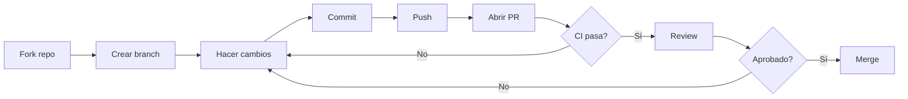

# 🚀 CI/CD - Integración y Despliegue Continuos

> **Versión**: 1.0  
> **Última actualización**: 8 de noviembre de 2025  
> **Estado**: ✅ Operativo

---

## 📋 Tabla de Contenidos

- [Visión General](#-visión-general)
- [Workflows Implementados](#-workflows-implementados)
- [Badges y Monitoreo](#-badges-y-monitoreo)
- [Configuración de Codecov](#-configuración-de-codecov)
- [Branch Protection](#-branch-protection)
- [Troubleshooting](#-troubleshooting)
- [Guía para Contribuidores](#-guía-para-contribuidores)

---

## 🎯 Visión General

El proyecto **Guardias de Patio** utiliza **GitHub Actions** para automatizar:

- ✅ **Tests automatizados** en múltiples versiones de Python y sistemas operativos
- ✅ **Análisis de cobertura** con Codecov
- ✅ **Linting y formateo** con ruff, mypy, black, isort
- ✅ **Auditorías de seguridad** con safety y bandit
- ✅ **Releases automatizados** con generación de changelog y construcción de ejecutables

### Arquitectura de Workflows

```
.github/workflows/
├── ci.yml        # Pipeline principal: tests, lint, security
└── release.yml   # Releases automatizados con artefactos
```

---

## 🔧 Workflows Implementados

### 1. CI/CD Pipeline (`ci.yml`)

**Trigger**: Push a `main`/`develop`, Pull Requests, Manual, Semanal (lunes 2:00 AM)

#### Job: `test`

Ejecuta tests en **matriz de configuraciones**:

| OS | Python | Propósito |
|----|--------|-----------|
| Ubuntu | 3.9, 3.10, 3.11, 3.12 | Cobertura completa de versiones |
| macOS | 3.11, 3.12 | Verificación en macOS |

**Pasos clave**:
1. **Checkout código** con `actions/checkout@v4`
2. **Setup Python** con cache de pip
3. **Instalar Qt** (solo Linux): dependencias del sistema para PyQt6
4. **Instalar dependencias**: requirements.txt + herramientas de testing
5. **Ejecutar tests**: pytest con cobertura
6. **Subir artefactos**: resultados JUnit + HTML de cobertura
7. **Codecov**: subir cobertura solo desde Python 3.11 + Ubuntu

**Variables de entorno**:
```bash
QT_QPA_PLATFORM=offscreen  # Qt sin display gráfico
DISPLAY=:99                # Virtual X server
```

**Tiempo estimado**: 3-5 minutos por configuración

#### Job: `lint`

Ejecuta herramientas de calidad de código en Python 3.11:

| Herramienta | Propósito | Continuar en error |
|-------------|-----------|-------------------|
| **ruff** | Linting rápido | ✅ Sí |
| **mypy** | Type checking | ✅ Sí (progresivo) |
| **black** | Verificar formato | ✅ Sí |
| **isort** | Verificar imports | ✅ Sí |

**Estrategia mypy**:
- **Strict** en: `core/`, `domain/entities/`, `domain/repositories/`
- **Normal** en: `application/use_cases/`, `infrastructure/repositories/`
- **No bloquea CI**: errores reportados pero no fallan el workflow

**Tiempo estimado**: 1-2 minutos

#### Job: `security`

Auditoría de seguridad en Python 3.11:

| Herramienta | Verifica | Salida |
|-------------|----------|--------|
| **safety** | Vulnerabilidades en dependencias | JSON |
| **bandit** | Código inseguro (hard-coded passwords, etc.) | JSON |

**Notas**:
- No bloquea CI (`continue-on-error: true`)
- Genera reportes como artefactos
- **Programado**: Semanal (lunes 2 AM)

**Tiempo estimado**: 2-3 minutos

#### Job: `build-summary`

Resumen final de todos los jobs:
- ✅ Si todos pasaron → Exit 0
- ❌ Si alguno falló → Exit 1

---

### 2. Release Workflow (`release.yml`)

**Trigger**:
- Push de tags `v*.*.*` (ej: `v3.0.0`)
- Manual con input de versión

**Permisos**:
- `contents: write` - Para crear releases
- `pull-requests: write` - Para comentar en PRs

#### Job: `validate`

1. **Obtener versión**: desde tag o input manual
2. **Ejecutar tests**: asegurar que el código funciona
3. **Linting**: verificar calidad
4. **Validar versión**: verificar que `pyproject.toml` coincide

#### Job: `build`

Construye ejecutables para **3 plataformas**:

| Plataforma | Herramienta | Formato | Spec |
|------------|-------------|---------|------|
| Linux | PyInstaller | `.tar.gz` | `Guardias de Patio.spec` |
| macOS | PyInstaller | `.zip` | `Guardias de Patio.spec` |
| Windows | PyInstaller | `.zip` | `GuardiasDePatio.spec` |

**Salida**:
```
guardias-patio-v3.0.0-linux.tar.gz
guardias-patio-v3.0.0-macos.zip
guardias-patio-v3.0.0-windows.zip
```

#### Job: `release`

1. **Generar changelog**: commits desde último tag
2. **Crear release notes**: incluye instrucciones de instalación
3. **Crear GitHub Release**: como **draft** (revisión manual)
4. **Adjuntar artefactos**: los 3 ejecutables

**Release Notes incluyen**:
- Listado de commits
- Instrucciones de instalación por plataforma
- Enlaces a documentación

---

## 📊 Badges y Monitoreo

### Badges Implementados

```markdown
[](...)
[](...)
[](...)
```

| Badge | Indica | Actualización |
|-------|--------|---------------|
| **CI/CD Pipeline** | Estado del último workflow | Tiempo real |
| **codecov** | % de cobertura de tests | Cada push a main |
| **Release** | Última versión publicada | Cada release |

### Interpretación de Estados

#### CI/CD Pipeline Badge

- 🟢 **passing**: Todos los tests y checks pasaron
- 🔴 **failing**: Al menos un test falló
- 🟡 **pending**: Workflow en ejecución
- ⚪ **no status**: No se ha ejecutado

#### Codecov Badge

- 🟢 **≥70%**: Cobertura buena
- 🟡 **46-70%**: Cobertura aceptable (actual: 46.31%)
- 🔴 **<46%**: Cobertura bajó (alerta)

### Dashboard de Monitoreo

**GitHub Actions**: `https://github.com/cferrerobonet/guardias_patio/actions`

- Ver historial de workflows
- Descargar artefactos (coverage, test results, security reports)
- Re-ejecutar workflows fallidos
- Ver logs detallados

**Codecov**: `https://codecov.io/gh/cferrerobonet/guardias_patio`

- Gráficas de evolución de cobertura
- Archivos con menor cobertura
- Comparación entre commits
- Comentarios automáticos en PRs

---

## 🔧 Configuración de Codecov

### Archivo: `.codecov.yml`

```yaml
coverage:
  precision: 2
  round: down
  range: "70...100"
  
  status:
    project:
      default:
        target: 46%  # Mantener cobertura actual
        threshold: 2%  # Permitir 2% de variación
    
    patch:
      default:
        target: 60%  # Nuevo código debe tener ≥60%
        threshold: 10%
```

### Umbrales de Cobertura

| Métrica | Valor | Descripción |
|---------|-------|-------------|
| **Project target** | 46% | Cobertura mínima del proyecto |
| **Project threshold** | ±2% | Variación permitida |
| **Patch target** | 60% | Cobertura mínima de código nuevo |
| **Patch threshold** | ±10% | Variación permitida en patches |

### Comportamiento en Pull Requests

1. **Comentario automático** con:
   - % de cobertura del PR
   - Diferencia con la base
   - Archivos modificados y su cobertura

2. **Status check**:
   - ✅ Si cobertura ≥ target
   - ❌ Si cobertura < target - threshold

3. **No bloquea merge**: `fail_ci_if_error: false`

---

## 🛡️ Branch Protection

### Configuración Recomendada (GitHub Settings)

**Rama**: `main`

#### Require Pull Request Reviews
```yaml
required_approving_review_count: 1
dismiss_stale_reviews: true
require_code_owner_reviews: false
```

#### Require Status Checks
```yaml
strict: true  # Require branches to be up to date
checks:
  - test (ubuntu-latest, 3.11)  # Python 3.11 en Ubuntu (crítico)
  - test (macos-latest, 3.11)   # macOS (crítico)
  - lint                         # Linting (crítico)
  - security                     # Seguridad (informativo)
```

#### Additional Settings
```yaml
require_linear_history: true
allow_force_pushes: false
allow_deletions: false
require_conversation_resolution: true
```

### Aplicar Protection Rules

1. **GitHub** → **Settings** → **Branches**
2. **Add branch protection rule**
3. **Branch name pattern**: `main`
4. Activar opciones arriba mencionadas
5. **Save changes**

### Bypass para Emergencias

**Permitir bypass**:
- Repositor admin
- Roles específicos (opcional)

**Cuándo usar**:
- Hotfixes críticos
- Fallos de CI por issues externos
- Ajustes de configuración de CI

---

## 🔍 Troubleshooting

### Tests Fallan en CI pero Pasan Localmente

**Causa común**: Diferencias de entorno

#### Solución 1: Dependencias de sistema (Linux)
```bash
# Verificar si falta alguna dependencia de Qt
sudo apt-get install -y libxkbcommon-x11-0 libxcb-icccm4 ...
```

#### Solución 2: Variables de entorno
```bash
# Reproducir entorno de CI localmente
export QT_QPA_PLATFORM=offscreen
export DISPLAY=:99
pytest tests/
```

#### Solución 3: Python virtual X server
```bash
# Iniciar Xvfb
Xvfb :99 -screen 0 1024x768x24 > /dev/null 2>&1 &
export DISPLAY=:99
pytest tests/
```

### Workflow Tarda Demasiado

**Tiempo esperado**: 8-12 minutos total

| Job | Tiempo Normal | Tiempo Excesivo |
|-----|---------------|-----------------|
| test (cada matriz) | 3-5 min | >10 min |
| lint | 1-2 min | >5 min |
| security | 2-3 min | >8 min |

#### Optimizaciones Aplicadas

1. **Cache de pip**: Reduce instalación de dependencias
```yaml
uses: actions/setup-python@v5
with:
  cache: 'pip'
```

2. **Paralelización**: Matriz de tests en paralelo
```yaml
strategy:
  fail-fast: false
  matrix: ...
```

3. **Artifacts con retención**: Solo 30 días
```yaml
retention-days: 30
```

### Codecov No Sube Cobertura

#### Verificar Token

**Error**: `Error: Codecov token not found`

**Solución**:
1. Ir a `https://codecov.io` → Vincular repo
2. Copiar token
3. GitHub → Settings → Secrets → New secret
4. Nombre: `CODECOV_TOKEN`
5. Valor: `<tu-token>`

#### Verificar Archivo coverage.xml

```bash
# Localmente, verificar que se genera
pytest --cov=src --cov-report=xml
ls -la coverage.xml  # Debe existir
```

### Release Workflow Falla

#### Error: "Version mismatch"

**Causa**: `pyproject.toml` no coincide con tag

**Solución**:
```bash
# Antes de crear tag
nano pyproject.toml  # Actualizar version = "3.0.1"
git add pyproject.toml
git commit -m "chore: bump version to 3.0.1"
git tag v3.0.1
git push origin main --tags
```

#### Error: "PyInstaller failed"

**Causa**: Spec file desactualizado o dependencias faltantes

**Solución**:
```bash
# Probar construcción localmente
pyinstaller --clean --noconfirm "Guardias de Patio.spec"

# Si falla, regenerar spec
pyi-makespec --name "Guardias de Patio" \
             --onedir \
             --windowed \
             --add-data "imagenes:imagenes" \
             src/main.py
```

---

## 👥 Guía para Contribuidores

### Workflow de Desarrollo



### Antes de Crear PR

#### 1. Ejecutar Tests Localmente

```bash
# Todos los tests
pytest tests/ -v

# Con cobertura
pytest tests/ --cov=src --cov-report=term-missing

# Solo tests rápidos
pytest tests/ -m "not slow"
```

#### 2. Ejecutar Linting

```bash
# Ruff (auto-fix)
ruff check src/ tests/ --fix

# Black (formateo)
black src/ tests/

# isort (ordenar imports)
isort src/ tests/

# mypy (type checking)
mypy src/ --config-file=mypy.ini
```

#### 3. Verificar Cobertura

**Target**: Nuevo código con ≥60% cobertura

```bash
pytest tests/ --cov=src --cov-report=html
open htmlcov/index.html  # Ver archivos sin cubrir
```

### Durante el PR

#### Checks Automáticos

Tu PR activará **automáticamente**:
- ✅ Tests en Python 3.9, 3.10, 3.11, 3.12
- ✅ Tests en Ubuntu y macOS
- ✅ Linting con ruff, mypy, black, isort
- ✅ Auditoría de seguridad
- ✅ Análisis de cobertura con Codecov

#### Interpretar Resultados

**Todos verde (✅)**:
- Tu código pasa todos los checks
- Puede ser revisado para merge

**Alguno rojo (❌)**:
- Revisa logs en GitHub Actions
- Corrige errores
- Push nuevos commits (CI se ejecuta automáticamente)

**Codecov comenta**:
- No bloquea merge
- Informativo: muestra cambio en cobertura

### Crear Release

#### Proceso Manual

```bash
# 1. Actualizar versión
nano pyproject.toml  # Cambiar version = "3.0.1"
nano version_info.txt  # Cambiar versión para Windows

# 2. Actualizar CHANGELOG
nano documentacion/CHANGELOG.md

# 3. Commit y tag
git add pyproject.toml version_info.txt documentacion/CHANGELOG.md
git commit -m "chore: bump version to 3.0.1"
git tag -a v3.0.1 -m "Release v3.0.1"
git push origin main --tags

# 4. Esperar workflow de release
# - Se ejecuta automáticamente
# - Crea draft release en GitHub
# - Adjunta ejecutables para Linux/macOS/Windows

# 5. Revisar y publicar
# GitHub → Releases → Revisar draft → Publish release
```

#### Proceso Automático

```bash
# Opción 2: Workflow manual
# GitHub → Actions → Release → Run workflow
# Input: versión (ej: 3.0.1)
# Output: Draft release automático
```

---

## 📚 Referencias

### Documentación Oficial

- [GitHub Actions Docs](https://docs.github.com/en/actions)
- [Codecov Docs](https://docs.codecov.com/)
- [PyInstaller Docs](https://pyinstaller.org/en/stable/)

### Workflows en Este Proyecto

- `.github/workflows/ci.yml` - Pipeline principal
- `.github/workflows/release.yml` - Releases automatizados
- `.codecov.yml` - Configuración de Codecov

### Documentación del Proyecto

- [CONTRIBUTING.md](CONTRIBUTING.md) - Guía de contribución
- [TECHNICAL_GUIDE.md](TECHNICAL_GUIDE.md) - Arquitectura técnica
- [DEPLOYMENT.md](DEPLOYMENT.md) - Compilación y distribución

---

## 📊 Estadísticas

### Estado Actual del CI/CD

| Métrica | Valor |
|---------|-------|
| **Workflows activos** | 2 (ci.yml, release.yml) |
| **Jobs por workflow** | 4 (test, lint, security, build-summary) |
| **Matriz de tests** | 6 configuraciones (3 OS × 2 versiones Python + 2 extras) |
| **Tiempo promedio** | 10-12 minutos |
| **Cobertura actual** | 46.31% |
| **Target de cobertura** | 46% (±2%) |
| **Releases automatizados** | ✅ Sí |
| **Plataformas soportadas** | Linux, macOS, Windows |

---

**Mantenido por**: Carlos Ferrero Bonet  
**Proyecto**: Guardias de Patio v3.0.0  
**Última revisión**: 8 de noviembre de 2025
