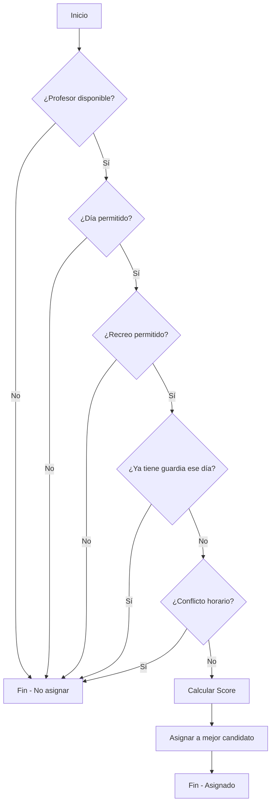

# Validaciones y Reglas del Sistema

Documentación completa de las reglas de negocio, validaciones y restricciones del sistema de asignación de guardias.

## 📚 Contenido

### [Reglas Completas de Asignación](reglas-completas.md)
Documento consolidado con todas las reglas del sistema:
- **Condiciones Generales**: Aplicables a todos los profesores
- **Condiciones Particulares**: Específicas por tipo de profesor (tutores, tiempo parcial, etc.)
- **Validaciones de Asignación**: Comprobaciones automáticas del sistema
- Prioridades y ponderaciones
- Restricciones temporales

**Ideal para**: Entender el algoritmo completo de asignación

### [Máximo Una Guardia por Día](max-una-guardia-dia.md)
Restricción fundamental del sistema:
- Descripción: Un profesor no puede tener más de una guardia el mismo día
- Justificación pedagógica
- Implementación técnica
- Casos especiales y excepciones
- Tests de validación

**Ideal para**: Comprender esta restricción clave

### [No Simultaneidad](no-simultaneidad.md)
Validación de conflictos horarios:
- Descripción: Un profesor no puede estar en dos sitios a la vez
- Detección de conflictos
- Prevención automática
- Casos de uso
- Implementación en el algoritmo

**Ideal para**: Evitar asignaciones conflictivas

## 🎯 Tipos de Reglas

### 1. Restricciones Absolutas (MUST)
Estas reglas **nunca** se pueden violar:
- ✅ Máximo 1 guardia por día
- ✅ No simultaneidad (mismo horario)
- ✅ Respetar días/recreos no permitidos
- ✅ No asignar en días festivos/no lectivos

### 2. Preferencias (SHOULD)
Estas reglas se intentan cumplir pero pueden violarse si es necesario:
- 🟡 Mantener zona preferida del profesor
- 🟡 Distribución equitativa de guardias
- 🟡 Continuidad de días (evitar gaps)
- 🟡 Mismos recreos para facilitar coordinación

### 3. Optimizaciones (NICE TO HAVE)
Mejoras que se aplican cuando es posible:
- 🔵 Minimizar cambios de zona
- 🔵 Agrupar guardias de un mismo profesor
- 🔵 Balancear carga entre turnos

## 📊 Proceso de Asignación



## 🔍 Scoring y Priorización

El sistema usa un score de 5 tuplas para elegir al mejor candidato:

```python
score = (
    zona_preferida,    # +100 si coincide, -50 si no
    deficit_guardias,  # Diferencia vs objetivo
    continuidad_dias,  # +1 por días consecutivos
    mismo_recreo,      # +1 si mismo recreo
    random             # Desempate aleatorio
)
```

**Orden de prioridad**: Mayor a menor (tupla se compara elemento por elemento)

## ⚖️ Balanceo de Carga

### Cálculo de Guardias Esperadas

```
guardias_esperadas = (horas_contrato / 25) * guardias_totales_periodo
```

**Ejemplo**:
- Profesor con 15 horas semanales
- Total guardias período: 200
- Guardias esperadas: (15/25) * 200 = 120 guardias

### Ajustes por Condición

| Condición | Multiplicador | Ejemplo (20 guardias base) |
|-----------|---------------|----------------------------|
| No tutor  | 1.0           | 20 guardias                |
| Tutor     | 1.5           | 30 guardias                |
| Reducción | 0.7           | 14 guardias                |
| Directivo | 0.5           | 10 guardias                |

## 🚫 Exclusiones Automáticas

Un profesor **NO** puede ser asignado si:
- ❌ Fecha fuera de su rango `fecha_inicio_guardias`
- ❌ Día de la semana no está en `dias_semana_permitidos`
- ❌ Recreo no está en `recreos_permitidos`
- ❌ Ya tiene guardia asignada ese día
- ❌ Está de ausencia (baja, permiso, etc.)
- ❌ Día es festivo o no lectivo

## 🔐 Validaciones en Tiempo Real

### Al Asignar Manualmente
El sistema valida:
1. Restricciones absolutas (bloquea asignación si se violan)
2. Preferencias (muestra warning pero permite)
3. Actualiza score y estadísticas

### Al Generar Calendario Automáticamente
El sistema:
1. Filtra candidatos por restricciones absolutas
2. Calcula score para cada candidato válido
3. Elige candidato con mejor score
4. Registra zona preferida si es primera asignación
5. Actualiza estadísticas y continúa

## 💡 Casos Especiales

### Profesor de Tiempo Parcial
- Guardias reducidas proporcionalmente
- Puede tener restricciones de días/horarios
- Ejemplo: 15h/semana = 60% guardias de jornada completa

### Profesor Tutor
- Multiplicador 1.5 de guardias
- Mayor peso en asignación
- Puede tener recreos específicos por tutoría

### Profesor con Reducción de Jornada
- Ajuste según porcentaje de reducción
- Respeta sus limitaciones horarias
- Ejemplo: Reducción del 33% → 67% de guardias

### Profesor en Comisión de Servicios
- Guardias reducidas drásticamente
- Solo recreos específicos
- Validación estricta de disponibilidad

## 🧪 Testing de Validaciones

Todos los tests se ejecutan en `tests/`:

```bash
# Test de regla max 1 guardia/día
pytest tests/test_max_una_guardia_dia.py

# Test de validaciones generales
pytest tests/test_validators.py

# Test del asignador completo
pytest tests/test_asignador.py
```

## 📈 Métricas de Calidad

El sistema monitoriza:
- **Distribución de guardias**: Desviación estándar vs objetivo
- **Cumplimiento de zona preferida**: % de guardias en zona preferida
- **Balance de carga**: Diferencia entre profesor con más y menos guardias
- **Restricciones violadas**: Debería ser siempre 0

## 🔗 Ver También

- [Guía de Desarrollo](../desarrollo/guia-desarrollo.md) - Implementación técnica
- [Zona Preferida](../versiones/v2.6/zona-preferida.md) - Detalle de esta feature
- [Características del Sistema](../tecnico/caracteristicas-sistema.md) - Especificaciones

## 📝 Notas Importantes

⚠️ **Cambios en las Reglas**
Si necesitas modificar una regla:
1. Consulta con el equipo pedagógico
2. Actualiza esta documentación
3. Modifica el código en `src/services/asignador_guardias.py`
4. Añade/actualiza tests correspondientes
5. Actualiza el CHANGELOG

⚠️ **Reglas Personalizadas por Centro**
Algunos centros pueden tener reglas adicionales. Documéntalas en un archivo separado `reglas-personalizadas-[nombre-centro].md` y añade referencia aquí.

---

[← Volver al índice principal](../README.md)
