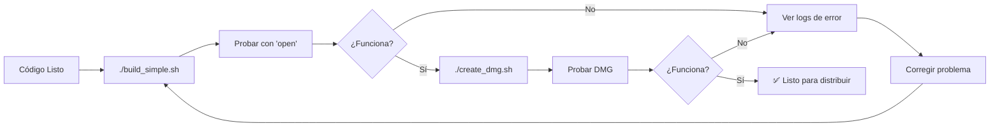

# Scripts de Compilación - Guardias de Patio

## 📋 Índice

- [Scripts Disponibles](#scripts-disponibles)
- [Uso Rápido](#uso-rápido)
- [Dependencias Críticas](#dependencias-críticas)
- [Problemas Comunes](#problemas-comunes)
- [Documentación Completa](#documentación-completa)

---

## 🚀 Scripts Disponibles

### 1. `build_simple.sh`
Compila la aplicación usando PyInstaller sin archivos .spec.

**Características:**
- ✅ Evita bug de PyQt6 con archivos .spec
- ✅ Incluye matplotlib y pandas (REQUERIDOS)
- ✅ Genera bundle macOS: `dist/Guardias de Patio.app`
- ✅ Tamaño del DMG: ~100 MB

**Uso:**
```bash
./build_simple.sh
```

### 2. `create_dmg.sh`
Crea un instalador DMG listo para distribución.

**Características:**
- ✅ DMG personalizado con fondo y layout
- ✅ Incluye symlink a Applications
- ✅ README con instrucciones
- ✅ Compresión UDZO

**Uso:**
```bash
# Primero compilar la app
./build_simple.sh

# Luego crear el DMG
./create_dmg.sh
```

---

## ⚡ Uso Rápido

### Compilación Completa (App + DMG)

```bash
cd scripts/build
./build_simple.sh && ./create_dmg.sh
```

Esto genera:
- `dist/Guardias de Patio.app` - Aplicación compilada
- `dist/GuardiasDePatio-3.0.0-macOS.dmg` - Instalador para distribución

---

## ⚠️ DEPENDENCIAS CRÍTICAS

### 🚨 NO EXCLUIR Estos Módulos

La aplicación **REQUIERE** los siguientes módulos para funcionar:

| Módulo | Archivo que lo usa | Línea | Razón |
|--------|-------------------|-------|-------|
| **matplotlib** | `src/presentation/widgets/panel_estadisticas.py` | 9 | Gráficos estadísticos |
| **pandas** | Varios archivos de análisis | - | Procesamiento de datos |
| **PyQt6** | Toda la interfaz | - | Framework GUI |
| **sqlalchemy** | `src/database/` | - | Base de datos |
| **reportlab** | `src/services/exportador_pdf.py` | - | Generación de PDFs |
| **alembic** | `alembic/` | - | Migraciones de BD |

### ❌ Síntoma de Exclusión Incorrecta

Si excluyes matplotlib o pandas, la app:
- ✅ Compilará sin errores
- ❌ Se cerrará inmediatamente al ejecutar
- ❌ Error: `ModuleNotFoundError: No module named 'matplotlib'`

### ✅ Exclusiones Permitidas

Solo estos módulos pueden excluirse de forma segura:

```bash
--exclude-module=tkinter  # No usamos tkinter
```

---

## 🐛 Problemas Comunes

### Problema 1: App Crashea al Iniciar

**Síntoma:**
```bash
open "dist/Guardias de Patio.app"
# La app se cierra inmediatamente
```

**Diagnóstico:**
```bash
# Ejecutar directamente para ver el error
./dist/Guardias\ de\ Patio.app/Contents/MacOS/Guardias\ de\ Patio

# Si ves "ModuleNotFoundError: No module named 'matplotlib'"
# → El problema es exclusión incorrecta de dependencias
```

**Solución:**
1. Verificar que `build_simple.sh` NO tenga:
   - `--exclude-module=matplotlib`
   - `--exclude-module=pandas`
2. Recompilar con `./build_simple.sh`

---

### Problema 2: Compilación se Cuelga en "Building PKG"

**Síntoma:**
```
INFO: Building PKG (CArchive) Guardias de Patio.pkg
[Se queda congelado aquí indefinidamente]
```

**Causa:**
Estás usando un archivo `.spec` en lugar del comando directo.

**Solución:**
1. **NO** usar archivos `.spec`
2. Usar siempre `build_simple.sh` (comando directo de PyInstaller)
3. Si tienes un `.spec`, borrarlo: `rm "Guardias de Patio.spec"`

---

### Problema 3: Iconos No Se Cargan

**Síntoma:**
```
⚠️ Icono no encontrado: .../icons/login.svg
```

**Causa:**
Código usa rutas hardcodeadas en lugar de rutas adaptativas.

**Solución:**
Usar funciones de `core/paths.py`:

```python
# ❌ INCORRECTO
icon_path = "imagenes/icons/login.svg"

# ✅ CORRECTO
from core.paths import get_resources_directory
icon_path = get_resources_directory() / "icons" / "login.svg"
```

---

### Problema 4: Error "Read-only file system"

**Síntoma:**
```
[Errno 30] Read-only file system: 'logs'
```

**Causa:**
Código intenta crear directorios con rutas relativas.

**Solución:**
Usar rutas del sistema:

```python
# ❌ INCORRECTO
log_file = "logs/app.log"

# ✅ CORRECTO
from core.paths import get_logs_directory
log_file = get_logs_directory() / "app.log"
```

---

## 🧪 Verificación Post-Compilación

### Checklist de Pruebas

```bash
# 1. Verificar que la app existe
test -d "dist/Guardias de Patio.app" && echo "✅ App existe"

# 2. Probar ejecución directa
./dist/Guardias\ de\ Patio.app/Contents/MacOS/Guardias\ de\ Patio 2>&1 | head -20

# 3. Verificar que NO hay errores de módulos faltantes
./dist/Guardias\ de\ Patio.app/Contents/MacOS/Guardias\ de\ Patio 2>&1 | \
  grep -i "ModuleNotFoundError" && echo "❌ Faltan módulos" || echo "✅ Todos los módulos OK"

# 4. Probar apertura con 'open'
open "dist/Guardias de Patio.app"
# → Debe abrir la ventana de login

# 5. Verificar tamaño del DMG
ls -lh dist/*.dmg
# → Debe ser ~100 MB (con matplotlib/pandas)
```

---

## 📚 Documentación Completa

Para más información detallada, consulta:

- **Solución de Problemas**: `../../documentacion/archivo/SOLUCION_COMPILACION.md`
- **Sistema de Rutas**: `../../src/core/paths.py`
- **Configuración**: `../../src/config/settings.py`

---

## 📊 Especificaciones de Compilación

### Entorno Requerido

- **Python**: 3.11.14
- **PyInstaller**: 6.16.0
- **Sistema**: macOS (Apple Silicon o Intel)
- **Homebrew**: `/opt/homebrew/bin/python3.11`

### Tamaños Esperados

| Componente | Tamaño |
|------------|--------|
| Bundle .app | ~200 MB (descomprimido) |
| Ejecutable | ~28 MB |
| DMG comprimido | ~100 MB |
| Icono .icns | 1.3 MB (fondo blanco) |

### Estructura del Bundle

```
dist/Guardias de Patio.app/
├── Contents/
│   ├── Info.plist
│   ├── MacOS/
│   │   └── Guardias de Patio (ejecutable, 28 MB)
│   ├── Resources/
│   │   ├── imagenes/
│   │   │   ├── icono.icns
│   │   │   └── icons/ (archivos SVG)
│   │   ├── alembic.ini
│   │   └── alembic/ (migraciones)
│   └── Frameworks/ (matplotlib, pandas, PyQt6, etc.)
```

---

## 🎯 Reglas de Oro

### ✅ HACER

1. **Usar `build_simple.sh`** para compilar (evita bugs)
2. **Incluir matplotlib y pandas** (requeridos por la app)
3. **Probar con `open`** antes de distribuir
4. **Verificar tamaño ~100 MB** (confirma que incluye todo)
5. **Usar rutas de `core/paths.py`** siempre

### ❌ NO HACER

1. **NO usar archivos `.spec`** (causa cuelgues)
2. **NO excluir matplotlib/pandas** (causa crashes)
3. **NO usar rutas relativas** (falla en producción)
4. **NO asumir que compila = funciona** (siempre probar)
5. **NO distribuir sin probar con `open`** (puede fallar para usuarios)

---

## 🔄 Workflow de Distribución



---

**Última actualización:** 3 de Noviembre de 2025  
**Mantenedor:** Carlos Ferrero Bonet  
**Versión de la app:** 3.0.0
